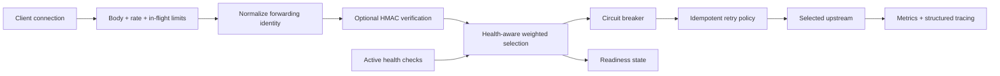

# IronRoute architecture

IronRoute is an adaptive edge gateway with an intentionally explicit request trust path. The design combines admission control, identity normalization, optional request signing, health-aware routing and bounded resilience behavior before traffic reaches an upstream.

## Request path



Client-provided forwarding identity is not trusted by default. IronRoute derives upstream-facing identity from the TCP peer, while trusted-proxy chaining remains outside v0.1 until a CIDR-aware trust policy exists.

## Engineering invariants

| Concern | IronRoute behavior |
| --- | --- |
| Admission control | Request bodies, per-identity rate limits and global in-flight work are bounded. |
| Identity trust | Client-supplied forwarding headers are removed and replaced from the observed TCP peer. |
| Rate-limit cardinality | The rate-limiter identity set is bounded rather than allowed to grow without limit. |
| Protected routes | Configured prefixes can require HMAC-SHA256 signatures over method, path/query, timestamp and body hash. |
| Replay exposure | Signed requests enforce bounded timestamp skew; v0.1 does not claim durable single-use nonce semantics. |
| Routing | Upstream selection is health-aware and weighted. |
| Failure isolation | Circuit breakers are per upstream and support half-open recovery. |
| Retry safety | Only GET, HEAD, OPTIONS, PUT and DELETE are retried in v0.1; POST and PATCH are not. |
| Load shedding | The global in-flight limit rejects excess work rather than permitting unbounded concurrency. |
| Header hygiene | Hop-by-hop headers and tokens named by `Connection` are sanitized before forwarding. |
| Readiness | `/readyz` fails when all upstreams are unavailable or unhealthy behind open circuits. |
| Dependency policy | RustSec and cargo-deny independently cover advisories plus license/ban/source policy. |
| Supply chain | Third-party GitHub Actions are pinned to reviewed immutable commit SHAs. |

## Resilience layers

The gateway does not rely on a single retry loop as its resilience strategy. Each layer addresses a different failure mode:

1. **Admission limits** bound work before expensive upstream processing.
2. **Active health checks** remove known-unhealthy choices from normal routing.
3. **Weighted selection** distributes traffic among viable upstreams.
4. **Circuit breakers** isolate repeatedly failing upstreams and probe recovery through half-open behavior.
5. **Retry policy** retries only the methods the v0.1 contract treats as semantically idempotent.
6. **Readiness** exposes whether the gateway currently has any viable upstream path.

These controls reduce failure amplification but do not turn the gateway into a distributed control plane or service mesh.

## Request-integrity boundary

For configured protected prefixes, IronRoute signs the canonical form:

```text
METHOD
PATH_AND_QUERY
UNIX_TIMESTAMP
SHA256_HEX(BODY)
```

The HMAC secret is environment-backed rather than stored in TOML. Timestamp validation narrows the replay window. It is deliberately documented as replay reduction, not strict replay prevention, because v0.1 has no durable nonce store.

## Proxy identity boundary

Incoming `Forwarded`, `X-Forwarded-*` and `X-Real-IP` values are untrusted. They are removed from the upstream path and replaced with identity derived from the actual TCP peer.

This avoids treating attacker-controlled headers as authoritative client identity. A future trusted-proxy mode requires an explicit CIDR-aware trust policy before forwarding chains can be accepted safely.

## Operational boundary

IronRoute exposes:

- `/healthz` for process health
- `/readyz` for upstream viability
- `/metrics` for Prometheus scraping
- structured JSON tracing
- graceful shutdown

Configuration is typed and validated before socket binding, separating configuration errors from live traffic handling.

## Verification and release boundary

Pull requests exercise Rust 1.97.1 and 1.98.1, formatting, Clippy with warnings denied, unit/socket-level tests, locked release builds, RustSec audit and cargo-deny policy. Release validation separately proves the native release build and production container build.

Tagged releases publish native binaries for Linux, Windows and macOS plus SHA-256 manifests. The GHCR image includes OCI metadata, SBOM and provenance. Third-party workflow dependencies are pinned to immutable reviewed commits.

## Explicit non-claims

v0.1 does not claim:

- service-mesh or Envoy replacement semantics
- downstream TLS termination or mTLS
- durable single-use replay protection
- trusted-proxy forwarding chains
- hot configuration reload
- multi-process control-plane state

Those are distinct capabilities that require additional protocol and operational evidence rather than labels added to the current gateway.